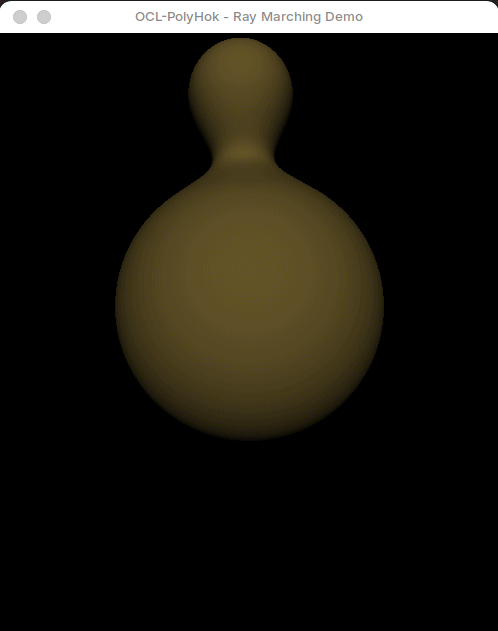

# OCL-PolyHok: Ray Marching Demonstration

This repository contains a demonstration of the [OCL-PolyHok](https://github.com/Equiel-1703/ocl-polyhok) DSL integrated with Elixir's powerful lightweight processes and actor model. We implemented a Ray Marching algorithm — a technique for rendering 3D scenes by stepping rays through space and using pure mathematical functions (Signed Distance Functions) to determine the distance to the nearest surface at each step.

The scene features a large bouncing sphere and a smaller one rotating around it, both rendered with dynamic, time-based colors. As the spheres approach each other, they create a smooth "metaball" effect, merging seamlessly before separating again as they move apart.

This demonstration serves as a proof of concept for the capabilities of OCL-PolyHok. It showcases how the DSL can process complex, real-time graphical rendering tasks on the GPU while leveraging Elixir's concurrency model to efficiently manage and display the generated frames.

<p align="center">
   
</p>

## Code Architecture

The code is structured around two concurrent Elixir processes operating in a producer-consumer pattern:

* **SDL2 (_consumer_)**: This is the display process. It manages the application window, waiting for frames to be sent by the rendering process and displaying them as they arrive. The module uses C++ NIFs to interface with the [SDL2 library](https://www.libsdl.org/).

* **RayMarching (_producer_)**: This is the render process. It generates the frames using OCL-PolyHok's ray marching kernel. It calculates the frame data on the GPU, retrieves the pixel array from device memory, and sends it directly to the window process for immediate display.

These processes operate independently and communicate asynchronously using Elixir's native message-passing system. The rendering process knows nothing about the display process; it simply generates frames and sends them to the window process's PID. Conversely, the window process doesn't know (and doesn't care) about the rendering process — it just waits for frames to arrive and calls the appropriate NIF functions to draw them into the screen.

The beauty of this design lies in its total decoupling. Either process can be modified, extended, or replaced without affecting the other. Because the rendering process is isolated and designed to be a high-performance producer (never blocking to wait for a response), it can focus solely on generating frames as fast as the GPU allows. Meanwhile, the window process efficiently handles the display without needing to know how or where the frames originated.

This separation of concerns creates a clean and resilient architecture that efficiently leverages Elixir's strengths in concurrency and fault tolerance. This foundational concept can be easily expanded into more complex applications, such as video streaming, real-time data visualization, or distributed rendering across multiple machines.

## Running the Demonstration

### Prerequisites

1. **Elixir 1.17.3 with Erlang/OTP 27 or higher**. We recommend using [asdf](https://asdf-vm.com/) to manage your Elixir and Erlang versions.
2. **Erlang/OTP Development Libraries**. These are needed to compile the Native Implemented Functions (NIFs). You can install them using your package manager. For Debian-based systems (APT), you can use the following command:

   ```bash
   sudo apt install erlang-dev
   ```

3. **GPU with OpenCL 2.0 support**. Check your GPU's specifications to ensure it supports OpenCL 2.0 or higher. You will also need the appropriate OpenCL drivers installed for your GPU.

4. **OpenCL generic ICD loader and C/C++ headers**. For Debian-based systems (APT), you can install them using the following command:

   ```bash
   sudo apt install ocl-icd-opencl-dev opencl-c-headers opencl-clhpp-headers
   ```

   Check [OCL-PolyHok's README](https://github.com/Equiel-1703/ocl-polyhok) for more details about setting up OpenCL on your system.

5. **SDL2 library and runtime**. For Debian-based systems (APT), you can install it using the following command:

   ```bash
   sudo apt install libsdl2-dev
   ```

### Compiling and Running

Once you have the prerequisites installed, you can compile and run the demonstration using the following commands:

1. First, clone the repository:

   ```bash
   git clone https://github.com/Equiel-1703/ocl-polyhok-demo.git
   cd ocl-polyhok-demo
   ```

2. Then, get the OCL-PolyHok dependencies with Mix:

   ```bash
   mix deps.get
   ```

3. Now, compile the NIFs libraries using Make:

   ```bash
   make all
   make demo
    ```

4. And compile the OCL-PolyHok DSL:

   ```bash
   mix compile
   ```

5. Finally, you can run the demonstration with:

   ```bash
   mix run elixir_demo/demo.exs
   ```

6. Enjoy the demo! To close the window, you can click the close button or press escape in your keyboard.

## License

This demo and the OCL-PolyHok project is licensed under the MIT License. See the [LICENSE](LICENSE) file for more details.
