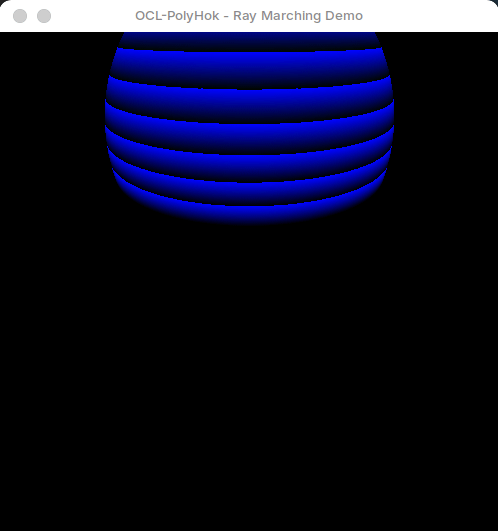

# OCL-PolyHok: A Ray Marching Demonstration

This repository contains a demonstration of the [OCL-PolyHok DSL](https://github.com/Equiel-1703/ocl-polyhok) used with Elixir's powerful lightweight processes and actors model. We implemented a ray marching algorithm with a main kernel and several helper device functions.

The scene is a bouncing sphere with changing colors that creates a visually appealing 'layer' effect. The demonstration is designed to be simple yet effective in showcasing the capabilities of the OCL-PolyHok DSL for GPU programming.

The code basically consists of two Elixir processes: one is responsible for the window (implemented with NIFs in C++ using the [SDL2 library](https://www.libsdl.org/)) and the other is responsible for generating the frames using OCL-PolyHok with the ray marching kernel. The two processes communicate with using Elixir's message passing system, with the OCL-PolyHok process sending the generated frames to the window process for display in a producer-consumer fashion.

<p align="center">
   
</p>

## Running the Demonstration

### Prerequisites

1. **Elixir 1.17.3 with Erlang/OTP 27 or higher**. We recommend using [asdf](https://asdf-vm.com/) to manage your Elixir and Erlang versions.
2. **Erlang/OTP Development Libraries**. These are needed to compile the Native Implemented Functions (NIFs). You can install them using your package manager. For Debian-based systems (APT), you can use the following command:

   ```bash
   sudo apt-get install erlang-dev
   ```

3. **GPU with OpenCL 2.0 support**.
4. **SDL2 library and runtime**. For Debian-based systems (APT), you can install it using the following command:

   ```bash
   sudo apt-get install libsdl2-dev
   ```

### Compiling and Running

Once you have the prerequisites installed, you can compile and run the demonstration using the following commands:

1. First, clone the repository:

   ```bash
   git clone https://github.com/Equiel-1703/ocl-polyhok-demo.git
   cd ocl-polyhok-demo
   ```

2. Then, get the OCL-PolyHok dependencies with Mix:

   ```bash
   mix deps.get
   ```

3. Now, compile the NIFs libraryes using Make:

   ```bash
   make all
   make demo
    ```

4. And the OCL-PolyHok DSL:

   ```bash
   mix compile
   ```

5. Finally, you can run the demonstration with:

   ```bash
   mix run elixir_demo/demo.exs
   ```

Enjoy the bouncing psichedelic ball! You should see a window displaying the ray marching demonstration. To close the window, simply click the close button or press escape.

## License

This demo and the OCL-PolyHok project is licensed under the MIT License. See the [LICENSE](LICENSE) file for more details.
